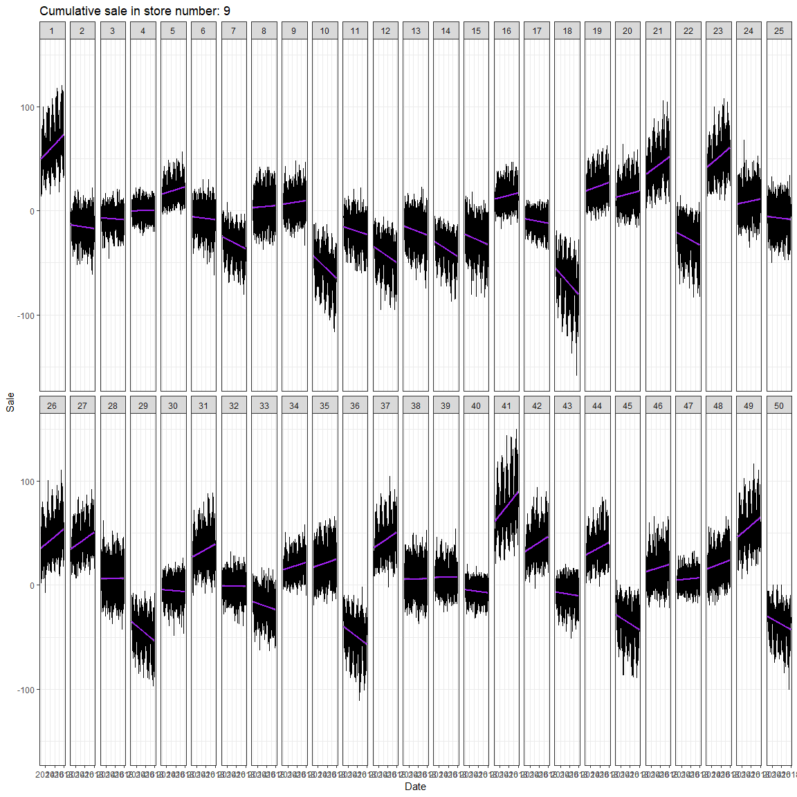

This exercise involves participating in one of Kaggle's competitions, [Store Item Demand Forecasting Challenge](https://www.kaggle.com/c/demand-forecasting-kernels-only). 

The instructions suggest a comparison of different methods, some using traditional statistical techniques such as ARIMA models and others using techniques such as XGBoost and neural networks. So as a team we say explore the three possibilities, this report documents the results obtained using ARIMA multivariate models.

**The criterion used to measure the performance of the prediction is [SMAPE](https://en.wikipedia.org/wiki/Symmetric_mean_absolute_percentage_error).**

First we load the necessary packages: 


```r
knitr::opts_chunk$set(echo = TRUE, cache=TRUE)
library(parallel) #for do quick the things  
library(tseries)
library(forecast) # for timeseries analysis
library(ggplot2)
library(plotly) # for nice plots
library(lubridate) # to work with dates easy 
#setwd("~/Desktop/BandaFastAI") #we set our working directory
```

Then we read the data and we change some types of data to facilitate data handling


```r
train <- read.csv("train.csv" , header = TRUE , sep = ",")
test <- read.csv("test.csv" , header = TRUE , sep = ",")
sample_submission <- read.csv("sample_submission.csv" , header = TRUE , sep = ",")
train$date <- ymd(train$date)
test$date <- ymd(test$date)
train$store <- factor(train$store)
train$item <- factor(train$item)
train2 <- ts(train)
```

First we seek to make the time series stationary, for this we consider two approaches. The first one approach was to consider each store (and its sales accumulated through the 50 items) as a time series. The second one considering each product (through the 10 stores) as a series of time by itself. 

In the following graphs we can see the first original series (lag = 0), first for the first approach:

**For brevity we only show the results of the first store or item and the last one.**


```r
# we define a funtion to plot severals lags and trends 
plot.tienda <- function(tienda, diferencia)
{
     if(diferencia==0){
        x <- subset(train, store ==as.character(tienda))
        p <- ggplot(x, aes(date, sales)) + geom_line()+ geom_smooth(method = "lm", colour = 'purple')+
        facet_wrap( facets = ~item , ncol = 25) + theme_bw() +
        ggtitle(paste0('Cumulative sale in store number: ',tienda )) + ylab('Sale') + xlab('Date')
        p
        #p <- ggplotly(p)
    } else{
    trainx <- train[order(train$date, train$store, train$item),]
    foo <- diff(trainx$sales, lag = diferencia)
    train2 <- data.frame(sales=foo)
    x <- cbind(train2, trainx[ 1:dim(train2)[1], 1:3])
    x <- subset(x, store ==as.character(tienda))
    p <- ggplot(x, aes(date, sales)) + geom_line()+ geom_smooth(method = "lm", colour = 'purple')+
    facet_wrap( facets = ~item , ncol = 25) + theme_bw() +
     ggtitle(paste0('Cumulative sale in store number: ',tienda )) + ylab('Sale') + xlab('Date') 
    p
    #p <- ggplotly(p)
    }
    return(p)
}
tiendas <- mclapply( sort(unique(as.character(train$store))), plot.tienda, diferencia=0)
tiendas[[1]]
```

<!-- -->

```r
#tiendas[[2]]
#tiendas[[6]]
#tiendas[[9]]
tiendas[[10]]
```

<!-- -->

```r
gc()
```

```
##            used  (Mb) gc trigger  (Mb) max used  (Mb)
## Ncells  1634178  87.3    2657772 142.0  2657772 142.0
## Vcells 13095125 100.0   21468864 163.8 21468326 163.8
```

```r
remove(tiendas)
```


Then the original series (lag=0) for the second approch:


```r
#ventas por producto
plot.item <- function(r, diferencia)
{
    if(diferencia==0){
        x <- subset(train, item ==as.character(r))
        p <- ggplot(x, aes(date, sales, color = I('black'))) + geom_line() + 
        geom_smooth(method = "lm", colour ='red') +
            facet_wrap( facets = ~ factor(store), ncol = 1) + theme_bw() +
            ggtitle(paste0('Cumulative sale for the item: ', r, " en diversas tiendas")) + ylab('Sale') + xlab('Date') 
        p
     #   p <- ggplotly(p)
        } else {
            trainx <- train[order(train$date, train$store, train$item),]
            foo <- diff(train$sales,lag =diferencia)
            train2 <- data.frame(sales=foo)
            x <- cbind(train2, train[ 1:dim(train2)[1], 1:3])
            x <- subset(train, item ==as.character(r))
            p <- ggplot(x, aes(date, sales, color = I('black'))) + geom_line() + 
                geom_smooth(method = "lm", colour ='red') +
                facet_wrap( facets = ~ factor(store), ncol = 1) + theme_bw() +  ggtitle(paste0('Cumulative sale for the item: ', r )) + 
    ylab('Sale') + xlab('Date')
            p
            #p <- ggplotly(p)
        }
    return(p)
}
item <- mclapply( sort(unique(as.character(train$item))), plot.item, diferencia=0)
item[[1]]
```

<!-- -->

```r
#item[[2]]
#item[[16]]
#item[[29]]
item[[30]]
```

<!-- -->

```r
remove(item)
gc()
```

```
##           used (Mb) gc trigger  (Mb) max used  (Mb)
## Ncells 1276473 68.2    2657772 142.0  2657772 142.0
## Vcells 8645322 66.0   21468864 163.8 21468726 163.8
```


Up to this point we finded that separately the data presents a tendency for both products and stores, we agree that there is a trend. We proceed to identify if the trend is of second order taking the first differences of the two approaches.


Store sales (with lag of 1, first differences). 


```r
tiendas <- lapply( sort(unique(as.character(train$store))), plot.tienda, diferencia = 1 )
tiendas[[1]]
```

<!-- -->

```r
#tiendas[[6]]
tiendas[[10]]
```

<!-- -->

```r
remove(tiendas)
gc()
```

```
##            used  (Mb) gc trigger  (Mb) max used  (Mb)
## Ncells  1636215  87.4    2657772 142.0  2657772 142.0
## Vcells 14292624 109.1   59133210 451.2 61506091 469.3
```

Sale of product through stores (first differences, lag = 1)


```r
item <- lapply( sort(unique(as.character(train$item))), plot.item, diferencia =1)
item[[1]]
```

<!-- -->

```r
#item[[2]]
#item[[16]]
#item[[29]]
item[[30]]
```

<!-- -->

```r
remove(item)
gc()
```

```
##            used (Mb) gc trigger   (Mb)  max used   (Mb)
## Ncells  1277814 68.3    3112345  166.3   3112345  166.3
## Vcells 12301176 93.9  204465521 1560.0 212663223 1622.5
```


The first differences above allow us to observe that the trend varies depending on the product and also the store. However, in the case of stores, this trend is more homogeneous.

Later we visualize different lags of the two approaches, then we show the trends of the series for lag = 37:


```r
tiendas <- lapply( sort(unique(as.character(train$store))), plot.tienda, diferencia = 37 )
tiendas[[1]]
```

<!-- -->

```r
#tiendas[[6]]
tiendas[[10]]
```

<!-- -->

```r
remove(tiendas)
gc()
```

```
##            used  (Mb) gc trigger   (Mb)  max used   (Mb)
## Ncells  1636884  87.5    3112345  166.3   3112345  166.3
## Vcells 14284995 109.0  163572416 1248.0 212663223 1622.5
```

We proceed to graph the sales of item with lag=37.


```r
item <- lapply( sort(unique(as.character(train$item))), plot.item, diferencia =37)
item[[1]]
```

<!-- -->

```r
#item[[2]]
#item[[16]]
#item[[29]]
item[[30]]
```

<!-- -->

```r
remove(item)
gc()
```

```
##            used (Mb) gc trigger   (Mb)  max used   (Mb)
## Ncells  1278694 68.3    3112345  166.3   3112345  166.3
## Vcells 12301886 93.9  188576222 1438.8 235309936 1795.3
```


In all the sets of graphs above we can intuit that an AR model fits the data, we rule out the possibility of using MA models because for different lag (0,1,2, ..., 37) we haven´t approximately stationary series.


At this point when considering adjusting 50 univariate ARIMA models (one to forecast the sale of each item) following our first approach or adjusting 10 univariate ARIMA models, we obtain a performance (measured with SERMA) of approximately 53.1. In fact the benefit gained with 50 series instead of 10 does not justify the computational cost.

Given that the distribution of the values to be predicted (sales) has a positive bias (as we can see in the following graphs), one option was to consider the logarithmic transformation to reduce this bias, however, the prediction error using auro-regression models for the 50 or 10 series were filmed at 72.9 so we discarded the idea of making a transformation only in sales.


```r
names(train)
```

```
## [1] "date"  "store" "item"  "sales"
```

```r
ggplot(data = train, aes(sales)) + geom_histogram(aes(fill = I('blue4'))) + ggtitle('Total sales') +  ylab('') + xlab('') + theme_minimal()
```

```
## `stat_bin()` using `bins = 30`. Pick better value with `binwidth`.
```

<!-- -->

```r
ggplot(data = train, aes(log(sales+1))) + geom_histogram(aes(fill = I('purple'))) + ggtitle('Total log( sales + 1)') +  ylab('') + xlab('') + theme_minimal() 
```

```
## `stat_bin()` using `bins = 30`. Pick better value with `binwidth`.
```

<!-- -->

```r
ggplot(data = train, aes(sales)) + geom_histogram(aes(fill = I('blue4'))) + ggtitle('Total sales by item') +  ylab('') + xlab('') + theme_minimal() + facet_wrap( facets = ~item , nrow = 2)
```

```
## `stat_bin()` using `bins = 30`. Pick better value with `binwidth`.
```

<!-- -->

```r
ggplot(data = train, aes(log(sales+1))) + geom_histogram(aes(fill = I('purple'))) + ggtitle('Total log(sales + 1) by item') +  ylab('') + xlab('') + theme_minimal() + facet_wrap( facets = ~item , ncol = 2) 
```

```
## `stat_bin()` using `bins = 30`. Pick better value with `binwidth`.
```

<!-- -->

```r
ggplot(data = train, aes(sales)) + geom_histogram(aes(fill = I('blue4'))) + ggtitle('Total sales by store') +  ylab('') + xlab('') + theme_minimal() + facet_wrap( facets = ~store , ncol = 2) 
```

```
## `stat_bin()` using `bins = 30`. Pick better value with `binwidth`.
```

<!-- -->

```r
ggplot(data = train, aes(log(sales+1) )) + geom_histogram(aes(fill = I('purple'))) + ggtitle('Total log(sales +1) by store') +  ylab('') + xlab('') + theme_minimal() + facet_wrap( facets = ~store , ncol = 2) 
```

```
## `stat_bin()` using `bins = 30`. Pick better value with `binwidth`.
```

<!-- -->

Finally, we decided to consider an AR multivariate model, we do not consider MA multivariate models because to date we did not find an implementation of them in the R environment. However, we considered this option less practical, since in our univariate results we observed that the ARIMA models changed a lot in their part of mobile average models, so we considered that they would have little power of generalization (aka forecast).

Then, we proceed to consider a multivariate model of time series, that is, the sale of an item, or store, depends in turn on other items or stores, in an autoregressive manner. Seeking not to overfit our model instead of considering 50 serires (one per article) we consider 10 series (one for the sales of a store).

Then we have the random vector of sales in the 10 stores:

$\begin{pmatrix} x_1(t+1) \\x_2(t+1) \\ \dots \\ x_{10} (t+1) \end{pmatrix} = \begin{pmatrix} \theta_{1,1}x_1(t)+ \theta_{1,2}x_2(t)+ \dots \theta_{1,10}x_{10}(t)\\ \theta_{2,1}x_1(t)+ \theta_{2,2}x_2(t)+ \dots \theta_{2,10}x_{10}(t)\\ \dots\\ \theta_{10,1}x_1(t)+ \theta_{10,2}x_2(t)+ \dots\theta_{10,10}x_{10}(t)\end{pmatrix}$

Where $x_{i}(t)$ represents the sale of the i-th store on the day $t$, so we only need to stimate 100 parameters the $\theta_{i,j}$ with $i,j \in \{1,2,\dots, 10\}$ if we do not consider lags,  However, our estimates led us to consider an autoregressive vectorial model with a lag of 49 so we have the following model which requires estimating 4900 parameters.

$\begin{pmatrix} x_1(t+1) \\x_2(t+1) \\ \dots \\ x_{10} (t+1) \end{pmatrix} = \begin{pmatrix} \theta_{1,1}^0x_1(t)+ \theta_{1,1}^1x_1(t-1)+\dots + \theta_{1,1}^{49}x_1(t-49) + \dots + \theta_{1,10}^0x_{10}(t) + \theta_{1,10}^1x_{10}(t-1) +  \dots+ \theta_{1,10}^{49}x_{10}(t-49) \\ \theta_{2,1}^0x_1(t)+ \theta_{2,1}^1x_1(t-1)+\dots + \theta_{2,1}^{49}x_1(t-49) + \dots +\theta_{2,10}^0x_{10}(t) + \theta_{2,10}^1x_{10}(t-1) +  \dots+ \theta_{2,10}^{49}x_{10}(t-49) \\ \theta_{10,1}^0x_1(t)+ \theta_{10,1}^1x_1(t-1)+\dots + \theta_{10,1}^{49}x_1(t-49) + \dots + \theta_{10,10}^0x_{10}(t) + \theta_{10,10}^1x_{10}(t-1) +  \dots+ \theta_{10,10}^{49}x_{10}(t-49) \\\end{pmatrix}$

Where $x_{i}(t)$ represents the sale of the i-th store on the day $t$, so we only need to stimate and $\theta_{i,j}^k$ represents the coeficiente of the $k$-th lag of the $i-$th store in the vector $j$. So we need 490 parameters for each entry and how we had 10 entries we need 4900 parameters.

**Another possibility that we considered was to create 500 univariate series (one for the sales of each item in each store) and later perform item clusters with similar behaviors, however this approach is computationally intensive and would hardly leave us less than 10 series.**


# Fit the model
We fitt a model $AR(49)$


```r
serie <- train
#art <- split(train$sales, train$item)
art <- split(train$sales, train$store)
vector <- matrix(unlist(art), ncol = 10, byrow = TRUE)
#colnames(vector) <- as.character(unique(train$item))
colnames(vector) <- as.character(unique(train$store))
modelo <- ar(vector)
```

# Forecast

And finally we make the predictions for the whole *test*:


```r
library(dplyr)
#test %>% group_by(item) %>% summarise(futuro=n()) -> pasos
test %>% group_by(store) %>% summarise(futuro=n()) -> pasos
pronostico <- predict(modelo, n.ahead = pasos$futuro[1])
x <- unlist(as.matrix(pronostico$pred))
x <- matrix(unlist(x), ncol = 1, byrow = FALSE)
sample_submission$sales <- round(x)
write.csv(sample_submission , file = "sub_0.csv" , row.names = FALSE)
head(sample_submission)
```

```
##   id sales
## 1  0    47
## 2  1    56
## 3  2    67
## 4  3    53
## 5  4    67
## 6  5    51
```

# Discussion about the model

Although our current model requires the estimation of 4900 parameters, it seems reasonable to validate the assumptions that an autoregressive vector requires such that errors have zero mean, that is, $ E (e_t) = 0, \ forall, t $ (in our case we have that the mean of the errors is equal to 0.0010154  ).   

Another aspect to be considered is that the covariance between the errors of different inputs is zero between series, ie $cor(x_i(t), x_j(t)) = 0$ if ($i\neqj$ and $\forall t$),in our case this is not true and the correlation matrix is the following (which is far from the identity):


```r
r <- modelo$resid
r[is.na(r)] <- 0
cor(r)
```

```
##            1         2         3         4         5         6         7
## 1  1.0000000 0.1262669 0.1172766 0.1112427 0.1039856 0.1002247 0.1017293
## 2  0.1262669 1.0000000 0.1379904 0.1290587 0.1177022 0.1044468 0.1121305
## 3  0.1172766 0.1379904 1.0000000 0.1521169 0.1398037 0.1274614 0.1278265
## 4  0.1112427 0.1290587 0.1521169 1.0000000 0.1603315 0.1445706 0.1353055
## 5  0.1039856 0.1177022 0.1398037 0.1603315 1.0000000 0.1672223 0.1580518
## 6  0.1002247 0.1044468 0.1274614 0.1445706 0.1672223 1.0000000 0.1669462
## 7  0.1017293 0.1121305 0.1278265 0.1353055 0.1580518 0.1669462 1.0000000
## 8  0.1760076 0.1189055 0.1255590 0.1324567 0.1538829 0.1608052 0.1783840
## 9  0.1102111 0.1884391 0.1277264 0.1329929 0.1436137 0.1487884 0.1782835
## 10 0.1009881 0.1116188 0.1912896 0.1367017 0.1472263 0.1459669 0.1643036
##            8         9        10
## 1  0.1760076 0.1102111 0.1009881
## 2  0.1189055 0.1884391 0.1116188
## 3  0.1255590 0.1277264 0.1912896
## 4  0.1324567 0.1329929 0.1367017
## 5  0.1538829 0.1436137 0.1472263
## 6  0.1608052 0.1487884 0.1459669
## 7  0.1783840 0.1782835 0.1643036
## 8  1.0000000 0.1962532 0.1761764
## 9  0.1962532 1.0000000 0.2077935
## 10 0.1761764 0.2077935 1.0000000
```

And finally the assumption that the errors have zero correlation in each component of the vector is not fulfilled either because we have the following correlations for each input in the errors:


```r
t <- as.data.frame(r)
apply(t, 2, sd)
```

```
##        1        2        3        4        5        6        7        8 
## 8.134655 8.165103 8.253408 8.247742 8.322353 8.301777 8.401883 8.460408 
##        9       10 
## 8.531870 8.552756
```

So our model adjusted to an autoregressive vector of order 49 is far from fulfilling the statistical assumptions necessary to make inference with it, however we have achieved an error of 49.61861 in the challenge.

A future work path consists of smooth the original series (or the 10 series that are taken when considering the stores separately or the 50 series that are obtained when considering the items separately) but so far the implementations of the package smooth they throw errors of up to 200 measure with SMAPE.
